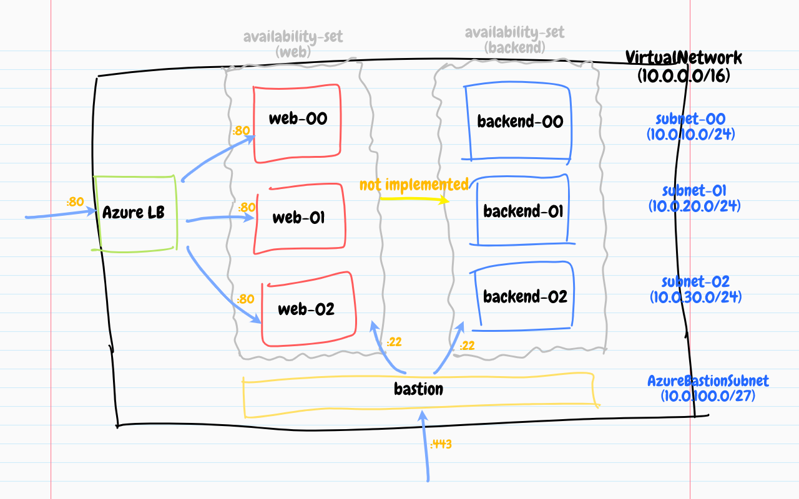
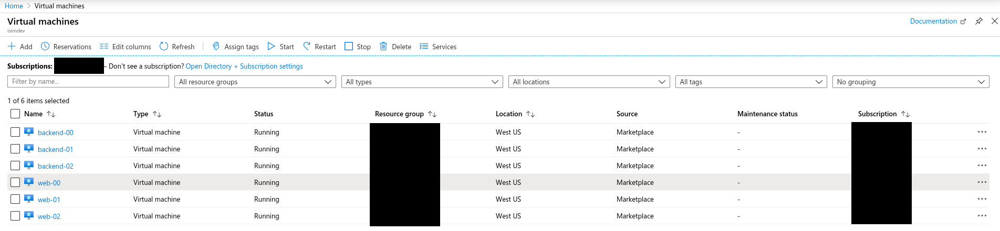
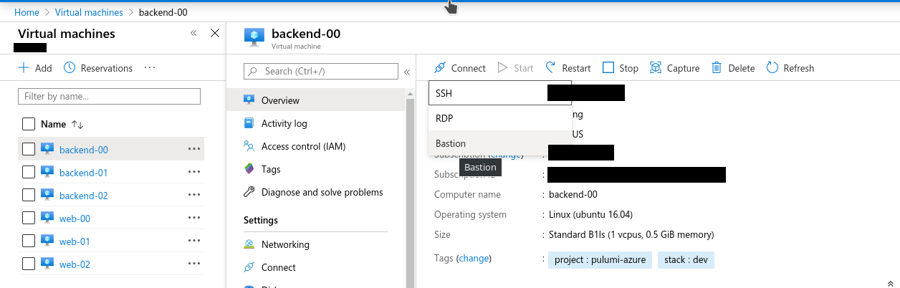
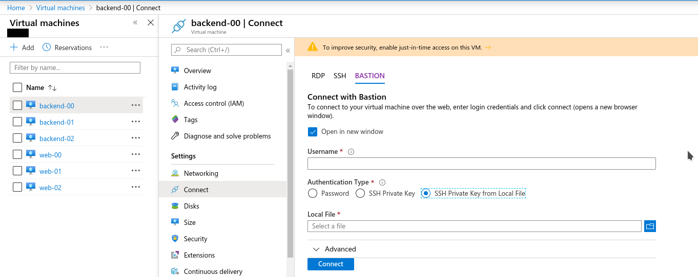
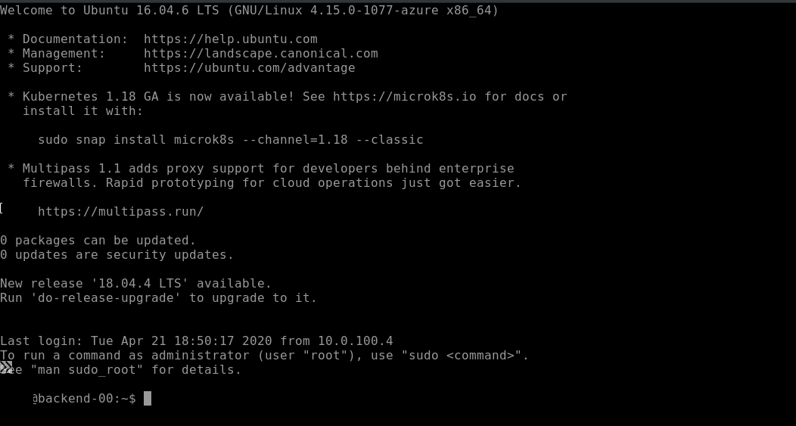
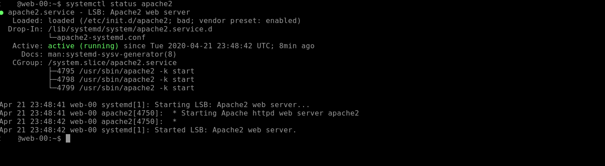
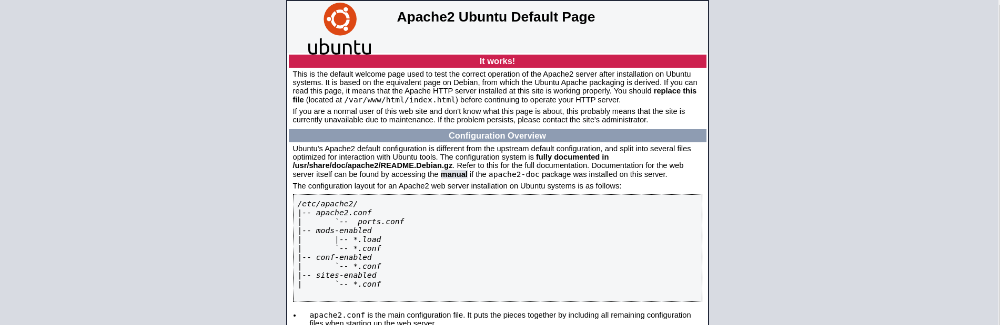

# Pulumi Azure

This project is a Pulumi program that knows how to provision the following Azure resources:

* A new Azure resource group
* A new virtual network with 3 subnets
* Two
[availability sets](https://docs.microsoft.com/en-us/azure/virtual-machines/windows/tutorial-availability-sets)
; `frontend` or `backend`
* Two
[application security groups](https://docs.microsoft.com/en-us/azure/virtual-network/application-security-groups)
; `web-servers` or `admin-servers`
* 3 `web` and 3 `backend` Ubuntu VMs with the following properties:
  * Deployed to private subnets
  * Grouped by availability sets
  * Assigned to application security groups
  * 30GB OS disk
* A network security group with rules to allow HTTP/HTTPS and SSH access to the
VMs
* A bastion host that allows external access to the private VMs



## Prerequisites

The following is a list of required software:

1. Pulumi v1.14.0
1. az-client 2.3.1

## Getting Started

Follow the instructions on the Pulumi
[docs](https://www.pulumi.com/docs/intro/cloud-providers/azure/setup/) to
configure Azure access.

Change the following credential properties of the VMs:

```
# the admin username on the VM
pulumi config set --path "osProfiles[0].adminPassword" <your-admin-password> --secret

# the admin password on the VM
pulumi config set --path "osProfiles[0].adminUsername" <your-admin-username> --secret

# the SSH pub key to be added to the VM
pulumi config set --path "osProfilesLinux[0].sshKeyData" <your-ssh-pub-key> --secret

# the path where the SSH key will be stored on the VM
pulumi config set --path "osProfilesLinux[0].sshKeyPath" <your-ssh-key-path> --secret
```

For more information on these properties, see:

* [`compute.VirtualMachineOsProfile`](https://godoc.org/github.com/pulumi/pulumi-azure/sdk/go/azure/compute#VirtualMachineOsProfile)
* [`compute.VirtualMachineOsProfileLinuxConfig`](https://godoc.org/github.com/pulumi/pulumi-azure/sdk/go/azure/compute#VirtualMachineOsProfileLinuxConfig)

To get a preview of what this Pulumi program does:

```
pulumi preview
```

To run this Pulumi program:

```
pulumi up
```

> :exclamation: The resource provisioning may fail during the first run, where
> the compute network interfaces can't find the subnet IDs in the appliers.
>
> This might have something to do with the `network.VirtualNetworkSubnet` type
> not being a `pulumi.CustomResourceState`.
>
> The workaround is to comment out everything after line 40 in
> `cmd/pulumi.main.go` during the first run, to provision all the network
> the network resources first. Then re-run `pulumi up` again with the compute
> provisioning code uncommented.

## What It Looks Like

Once the `pulumi up` command exited successfully, access the Azure portal to
view the fleet of VMs:



The private VM can be accessed via the Bastion host:



Enter the username and local path to your SSH private key:



Your web browser will establish a live secured session to the VM:



Confirm that `apache2` is installed and running on all the `web` VMs:



Locate the public IP address of the load balancer. Confirm that the `apache2`
home page is accessible at port 80:


